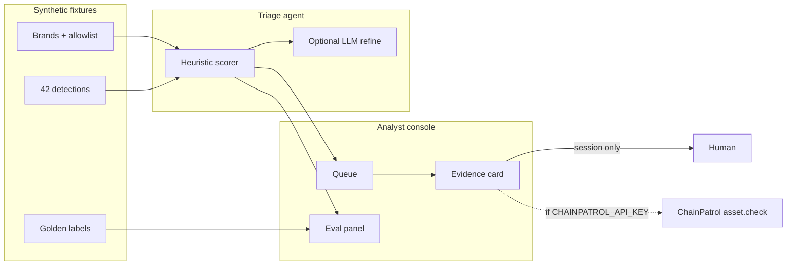

# Review Copilot

HITL (human-in-the-loop) triage agent for blockchain / crypto **brand-protection** phishing detections.

This is a portfolio demo for ChainPatrol founders (CEO Nikita Varabei, CTO Umar Ahmed). It is **not** a ChainPatrol rebuild. Review Copilot sits in the gap **between detection and blocklist**: an analyst force-multiplier that drafts a decision, never executes one.

```
fixtures → heuristic scorer (+ optional LLM) → draft APPROVE | REJECT | WATCHLIST
                 ↓
          analyst queue + evidence card
                 ↓
     human records a dry-run call (session only)
                 ↓
     optional read-only ChainPatrol asset.check
```

Dry-run is a hard invariant. There is no auto-approve, no auto-block, and no write to any registrar, wallet, or ChainPatrol list.

## Architecture



| Layer | Choice |
| --- | --- |
| App | Next.js App Router, TypeScript, Tailwind v4 |
| Data | Typed fixtures in `src/data/` (JSON-serializable, no database) |
| Agent | Deterministic heuristic in TypeScript; optional OpenAI / Anthropic rationale refine |
| Enrichment | Optional `POST https://app.chainpatrol.io/api/v2/asset/check` |
| Persistence | None. Human calls live in `sessionStorage` for the demo |
| UI | AWS Console–inspired analyst shell (Tailwind). Dark header, left nav, dense tables |

### Analyst console

The frontend is styled as a security/ops console rather than a consumer SaaS dashboard:

- Dark navy global header (`#232f3e`) with product mark, breadcrumb, and dry-run / scorer utilities
- Left resource navigation: Queue, Campaigns, Eval, About
- Dense filterable tables for detections, clusters, and eval mismatches
- Evidence detail as a split console page (key-value summary, comparison, IOC/signal sections, sticky draft + human-call panels)

Primary actions use Amazon-orange (`#ec7211`); links and selection use console blue (`#0073bb`). Layout is optimized for a desktop demo and remains usable on a narrow viewport via a collapsible nav.

### Decision vocabulary

| Draft | Meaning |
| --- | --- |
| **APPROVE** | Recommend adding the asset to a blocklist (malicious) |
| **REJECT** | Recommend dismissing the detection (false positive / official) |
| **WATCHLIST** | Hold — mixed or incomplete evidence |
| **Dry-run** | The draft is advisory. A human remains the decision-maker |

### How the scorer works

The heuristic never needs a network or an API key. It scores:

1. **Lookalike / lure-keyword domain** (Levenshtein + homoglyph folding + `brand-login` / `exchange-secure.com` tricks)
2. **WHOIS / DNS age** (stubbed registration age — no live WHOIS)
3. **HTML kit fingerprint** against a small malicious-kit catalog
4. **Visual similarity** (stubbed perceptual score on the fixture)
5. **Shared drain address** and campaign size
6. **Brand allowlist** (strong REJECT)

If `OPENAI_API_KEY` or `ANTHROPIC_API_KEY` is set, the evidence card can ask the LLM to refine the rationale. The model is instructed not to execute anything. If the call fails, the heuristic draft is kept.

## How to run

```bash
npm install
cp .env.example .env.local   # optional — demo runs without keys
npm run dev
```

Open [http://localhost:3000](http://localhost:3000).

```bash
npm run build    # production build
npm test         # scorer + eval threshold
npm run eval     # print precision / recall vs golden labels
npm run lint
```

No paid services, no domains to buy, no deploy required.

## Optional keys

Copy `.env.example` to `.env.local`. **Do not commit secrets.**

| Variable | Effect if set |
| --- | --- |
| `OPENAI_API_KEY` | Evidence card “Refine rationale with LLM” |
| `ANTHROPIC_API_KEY` | Same, used only when OpenAI is unset |
| `CHAINPATROL_API_KEY` | Read-only `asset.check` for the suspicious host |

Without keys, the header shows `LLM off` and `ChainPatrol offline`. Queue, evidence cards, clusters, and eval still work.

### How to request a ChainPatrol API key

1. Docs: [Get your API key](https://chainpatrol.com/docs/general/api-key)
2. Organization dashboard → **Settings** → **API keys** → **Create Key** (`cp_…`)
3. If you do not have org access yet, email [engineering@chainpatrol.io](mailto:engineering@chainpatrol.io)

The integration is **read-only**. Review Copilot never calls report/submit endpoints.

## Demo script (about 3 minutes)

1. **Open the queue.** Forty-two synthetic detections across Acme Wallet, Nova Exchange, and Helix Protocol. The dark header should say **Dry-run only**; the left nav lists Queue, Campaigns, Eval, and About.
2. **Filter the Acme drain · Sept cluster** (toolbar chips, or Campaigns → cluster name). Five lookalike hosts, one HTML kit (`wallet-connect-drainer-v3`), one shared drain. This is the campaign force-multiplier story: one payout address, many skins.
3. **Open `DET-2401` (`acme-wallet-connect.xyz`).** Console detail page: key-value summary, side-by-side suspicious vs official, IOCs, lookalike / WHOIS stub / kit / visual / shared drain, draft **APPROVE** with a checklist and rationale. Record a human call — it stays in session storage.
4. **Open `DET-2413` (`docs.acmewallet.io`).** Allowlisted official docs. Draft **REJECT**. Same agent, opposite call — this is the false-positive discipline.
5. **Open the Nova cluster, then `DET-2420` (`nova.exchange-secure.com`).** Host-trick: the registrable domain is `exchange-secure.com`, not `nova.exchange`. Same login-clone kit.
6. **Open Eval.** Precision / recall of drafts vs golden labels. Mismatches, if any, are the point of the panel — the scorer is measured, not trusted blindly.

Talking point: ChainPatrol already detects. Review Copilot is the analyst layer that clusters, explains, and waits.

## Fixtures

| Brand | Official | What the set contains |
| --- | --- | --- |
| Acme Wallet | `acmewallet.io` | Shared-drain campaign, seed/helpdesk/APK lures, parked/namesake watchlist, official docs/status/Mirror |
| Nova Exchange | `nova.exchange` | Login-clone kit campaign, KYC/APK lures, official blog/API + licensed widget |
| Helix Protocol | `helixprotocol.xyz` | Claim-portal airdrop campaign, fake bridge/governance, official docs/app |

All hosts, wallets, and HTML snippets are **synthetic**. Wallets such as `0x1111…d8a1` are demo drains, not observed victim addresses.

## Ethics

- Synthetic or public-looking IOCs only. No live phishing kits, no malware binaries, no credentialed access to anyone’s mailbox or wallet.
- No targeting of real victims and no instructions for running a campaign.
- The human remains the decision-maker. Dry-run is enforced in the draft object (`dryRun: true`) and in the UI.
- Optional ChainPatrol access is a status lookup, not a report.
- WHOIS, DNS, and visual similarity are **stubs with realistic mock data**, labeled as such. This repo does not scrape live phishing pages.

## Project map

```
src/app/                Queue, campaigns, evidence, eval, about, API routes
src/components/         Analyst console (AWS Console–style shell)
src/data/               Brands, allowlist, 42 detections, campaigns
src/lib/agent/          Signals, heuristic, optional LLM
src/lib/chainpatrol.ts  Optional asset.check client
src/lib/eval.ts         Golden-label report
```

## What this is not

Not a ChainPatrol clone, not a browser-extension blocker, not a multi-agent research platform, and not a live WHOIS / Playwright screenshot pipeline. Those are stretch goals. The MVP is a complete analyst loop on fixtures: queue → evidence → draft → eval.
